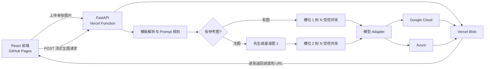

# 批图匠真实生图后端原型设计规格

## 1. 目标

在现有 React + TypeScript + Vite 高保真原型上，接入一个可部署到 Vercel 的 Python + FastAPI 后端，让“批量文生图”和“批量图生图”能够真实调用以下模型：

- Google Cloud Nano Banana 2：`gemini-3.1-flash-image`
- Google Cloud Nano Banana Pro：`gemini-3-pro-image`
- Azure GPT-Image-2：Azure 部署名称由环境变量提供

原型用于现场展示，重点证明以下能力：

- 后端直接规划生图 Prompt，不再依赖扣子或 Dify。
- 主图、套图、详情图和海报按模板生成。
- 有参考图时并发生成；无参考图时先生成基准图，再并发生成其余图片。
- 模型、比例、分辨率和质量参数能够动态传递，不产生排列组合节点。
- 图片生成进度和单张结果能够实时显示。

## 2. 已确认范围

### 2.1 本次真实接入

- 批量文生图。
- 批量图生图。
- 主图、套图、详情图和海报四种图片类型。
- Nano Banana 2、Nano Banana Pro、Azure GPT-Image-2 三个生图模型。
- Vercel FastAPI、Vercel Blob、流式进度和浏览器历史记录。

### 2.2 保留 Mock

- 批量 AI 修图。
- 批量模特换装。

### 2.3 本次不做

- 数据库、Redis、持久任务队列和跨设备任务恢复。
- 登录、计费、充值和正式权限系统。
- 页面关闭后恢复未完成任务。
- 海报文字的后端二次排版引擎。
- 生产级后台管理和配额管理页面。

## 3. 技术栈与取舍

### 3.1 前端

- React + TypeScript + Vite。
- 沿用现有 React Router、CSS Modules、Vitest 和 Testing Library。
- 继续部署到 GitHub Pages。

优点是能够复用现有工作台、历史记录和测试；缺点是前端与后端使用两种语言。

### 3.2 后端

- Python 3.12。
- FastAPI。
- Pydantic 负责请求、事件和模型配置校验。
- HTTPX 或官方 SDK 负责供应商调用。
- Pytest 负责后端测试。
- 部署为 Vercel Python Function，并启用 Fluid Compute。

Python 适合异步 I/O、模型适配和后续图片处理；本原型不引入常驻 Worker，避免超出展示范围。

## 4. 总体架构



职责边界：

- 前端负责收集参数、上传图片、消费流式事件、展示进度和保存完成记录。
- FastAPI 负责参数校验、参考图分析、Prompt 规划、模型适配、依赖编排、受控并发、重试和日志。
- Vercel Blob 负责保存参考图和生成结果。
- Google Cloud 与 Azure 只通过 Adapter 暴露统一的 `generate` 和 `edit` 能力。

## 5. 部署和密钥

前端不保存任何供应商密钥。后端通过 Vercel 环境变量读取：

```text
GOOGLE_CLOUD_PROJECT
GOOGLE_CLOUD_LOCATION
GOOGLE_SERVICE_ACCOUNT_JSON
GOOGLE_PROMPT_PLANNER_MODEL
AZURE_OPENAI_ENDPOINT
AZURE_OPENAI_API_KEY
AZURE_GPT_IMAGE_2_DEPLOYMENT
BLOB_READ_WRITE_TOKEN
BLOB_ALLOWED_HOST
ALLOWED_ORIGINS
```

默认值：

- `GOOGLE_CLOUD_LOCATION=global`
- `GOOGLE_PROMPT_PLANNER_MODEL=gemini-3.5-flash`

`ALLOWED_ORIGINS` 只允许正式 GitHub Pages 域名和本地开发地址。密钥、访问令牌和服务账号 JSON 不得进入前端变量、源码、日志或 Git。

## 6. 图片类型、模板与方案数量

### 6.1 方案数量

前端的生成数量统一改名为“方案数量”或在帮助文案中明确其含义。

- 套图方案数量 2：两套，每套 6 张，共 12 张。
- 详情图方案数量 2：两套，每套 5 张，共 10 张。
- 主图方案数量 2：两张不同主图。
- 海报方案数量 2：两张不同海报。

供应商调用固定为单槽位单请求。业务总张数由 `template.slots.length * variant_count` 决定。

### 6.2 默认模板

#### 套图 `set`

固定 6 个槽位：

1. 商品主图。
2. 角度或细节副图。
3. 核心卖点图。
4. 使用场景图。
5. 功能或定制展示图。
6. 包装或品牌信任图。

#### 详情图 `listing`

固定 5 个槽位：

1. 产品总览。
2. 材质与工艺。
3. 功能与利益点。
4. 应用场景。
5. 规格、包装或采购信息。

#### 主图 `main`

固定 1 个主图槽位。

#### 海报 `poster`

固定 1 个营销海报槽位。

### 6.3 模板结构

后端模板是唯一事实来源。前端只传 `template_id`，不传可被用户篡改的完整模板。

```json
{
  "id": "product_set_01",
  "image_type": "set",
  "name": "标准六图套图",
  "slots": [
    {
      "index": 1,
      "role": "main_image",
      "title": "商品主图",
      "objective": "完整展示商品主体",
      "composition": "主体居中，背景干净",
      "text_policy": "不主动生成未提供的文字"
    }
  ]
}
```

后端实际张数始终读取 `slots.length`，界面的 `1 / 6 / 5 / 1` 是当前默认模板的展示值，不是散落在业务代码中的硬编码。

## 7. Prompt 规划

### 7.1 Product Context

使用 `gemini-3.5-flash` 生成结构化 `product_context`。该模型与图片模型使用同一套 Google Cloud 凭证。

有参考图时，Planner 接收用户要求和参考图，提取：

- 商品主体。
- 外形、颜色、材质和结构。
- Logo 和可见文字位置。
- 必须保持的特征。
- 可以变化的背景、场景、光线和角度。
- 用户明确提供的事实。
- 无法确认的事实。

无参考图时，Planner 根据文字建立视觉设定。认证、参数、产能、客户案例、测试结论和其他未提供事实必须保持为空，不得编造。

### 7.2 Prompt Planner

Planner 接收：

```text
image_type
template
product_context
user_requirement
language
model_profile
variant_index
```

它通过结构化输出生成：

```json
{
  "product_context": {
    "subject": "商品描述",
    "must_keep": ["外形", "颜色", "材质"],
    "known_facts": [],
    "unknown_facts": []
  },
  "global_consistency_prompt": "同一套图片的统一约束",
  "image_prompts": [
    {
      "index": 1,
      "role": "main_image",
      "prompt": "给当前图片模型使用的完整提示词"
    }
  ]
}
```

后端必须验证：

- JSON 可以解析。
- `image_prompts` 数量等于模板槽位数量。
- 索引连续且与模板一致。
- 每条 Prompt 非空。
- 未出现模板外的槽位。

验证失败时只允许重新规划一次；再次失败则终止当前方案，不继续产生生图费用。

每个方案单独规划一次，以获得不同创意方向；同一方案内部共享 `product_context` 和一致性要求。

### 7.3 模型 Profile

- Nano Banana 2：强调紧凑、清晰、适合高频电商图。
- Nano Banana Pro：允许更复杂的构图、文字和场景推理。
- GPT-Image-2：明确产品保真、构图、材质、光线和文字要求。

模型差异只存在于 Profile 和 Adapter，不复制套图、详情图、主图和海报业务流程。

## 8. 有图和无图编排

### 8.1 有参考图

所有槽位使用同一组用户原始参考图：

```text
reference + prompt_1 -> image_1
reference + prompt_2 -> image_2
reference + prompt_N -> image_N
```

槽位之间没有依赖，可以受控并发。

### 8.2 无参考图

每个方案先生成槽位 1：

```text
prompt_1 -> anchor_image
```

基准图成功后，其他槽位统一使用基准图：

```text
anchor_image + prompt_2 -> image_2
anchor_image + prompt_3 -> image_3
anchor_image + prompt_N -> image_N
```

禁止使用 `image_1 -> image_2 -> image_3` 的连续传递方式。

主图和海报只有一个槽位，无需后续分发。不同方案之间可以并发，但仍受模型限流器约束。

## 9. 模型参数

### 9.1 Nano Banana 2

- 模型 ID：`gemini-3.1-flash-image`。
- 常用比例：`1:1、3:2、2:3、4:3、3:4、16:9、9:16`。
- 高级比例：`1:4、4:1、1:8、8:1、4:5、5:4、21:9、9:21`。
- 分辨率：`1K、2K、4K`。

### 9.2 Nano Banana Pro

- 模型 ID：`gemini-3-pro-image`。
- 比例：`1:1、3:2、2:3、4:3、3:4、4:5、5:4、16:9、9:16、21:9`。
- 分辨率：`1K、2K、4K`。

Google 请求映射：

```text
aspect_ratio -> generationConfig.imageConfig.aspectRatio
resolution   -> generationConfig.imageConfig.imageSize
```

Google 4K 输出在界面标记为预览能力。

### 9.3 Azure GPT-Image-2

- 比例：`1:1、3:2、2:3、4:3、3:4、16:9、9:16`。
- 分辨率档位：`1K、2K、4K`。
- 质量：`low、medium、high`。
- 默认：`1:1、2K、medium`。

`resolution` 与 `quality` 是两个独立字段。Adapter 根据比例和分辨率档位计算 `WIDTHxHEIGHT`，再独立传递 `quality`。

目标长边：

```text
1K -> 约 1024
2K -> 约 2048
4K -> 最高 3840
```

计算结果必须：

- 宽高均为 16 的倍数。
- 长边不超过 3840。
- 宽高比不超过 3:1。
- 总像素数在 655360 到 8294400 之间。

当目标尺寸超过总像素上限时，按比例缩小。后端把实际宽高作为流式事件的一部分返回前端，例如 `4K · 1:1 -> 2864 x 2864`。

## 10. 上传与存储

Vercel Function 请求体上限为 4.5 MB，因此单张上传限制为 4 MB。

上传流程：

```text
选择图片
-> 每张图片单独 POST /api/uploads
-> 校验 MIME、扩展名和大小
-> 写入 Vercel Blob
-> 返回 asset_id、URL、MIME 和大小
-> 生图请求只传已登记的 Blob URL
```

单个上传区最多 10 张。上传对象统一写入 `ptj/reference/` 路径。后端只接受主机等于 `BLOB_ALLOWED_HOST`、且路径以 `ptj/reference/` 开头的 Blob URL，不从任意用户 URL 抓取文件，避免 SSRF。这个校验不依赖数据库。

支持输入：

- PNG。
- JPEG。
- WebP。

BMP、TIFF 和 GIF 不进入本次真实生图链路；现有 Mock 页面可以继续显示旧提示，真实页面需更新为实际支持范围。

生成结果写入 Vercel Blob。前端只接收 URL，不接收巨型 Base64。

## 11. API 设计

```text
GET  /api/health
GET  /api/capabilities
POST /api/uploads
POST /api/generations/stream
```

### 11.1 生图请求

```json
{
  "mode": "image-to-image",
  "image_type": "set",
  "template_id": "product_set_01",
  "model": "nano_banana_2",
  "aspect_ratio": "1:1",
  "resolution": "2K",
  "quality": null,
  "language": "zh-CN",
  "variant_count": 1,
  "user_requirement": "高级简约，突出产品材质",
  "reference_assets": [
    {
      "asset_id": "asset_xxx",
      "url": "https://example.public.blob.vercel-storage.com/reference.png",
      "mime_type": "image/png"
    }
  ]
}
```

### 11.2 流式事件

响应使用 `application/x-ndjson`：

```json
{"type":"job_started","job_id":"job_xxx"}
{"type":"planning","message":"正在分析商品并规划 6 张套图"}
{"type":"plan_ready","variant":1,"expected_images":6}
{"type":"image_started","variant":1,"index":1,"role":"main_image"}
{"type":"image_completed","variant":1,"index":1,"url":"https://..."}
{"type":"image_failed","variant":1,"index":3,"retryable":true}
{"type":"job_completed","status":"partial_success"}
```

事件类型：

```text
job_started
planning
plan_ready
variant_started
anchor_started
anchor_completed
image_started
image_retrying
image_completed
image_failed
variant_completed
job_completed
job_failed
```

前端必须容忍未知事件，避免后端以后新增事件导致页面崩溃。

## 12. 页面设计

沿用现有橙色品牌和左右工作台结构，不新建独立演示页面。

### 12.1 左侧表单

- 图片类型选择。
- 模板选择。
- 用户要求。
- 参考图上传。
- 方案数量。
- 模型选择。
- 动态比例。
- 动态分辨率。
- Azure 专属质量选项。
- 当前模型能力提示。
- 实际输出数量和预计额度提示。

模型切换时保留仍兼容的参数；不兼容时切换到默认 `1:1 + 2K`。Azure 默认质量为 `medium`。

### 12.2 右侧生成控制台

- 显示模型、模板、实际尺寸和方案数量。
- 每套方案独立分组。
- 按模板槽位顺序预先创建结果位。
- 每张图分别展示等待、规划、生成、重试、完成和失败状态。
- 图片完成后立即显示并允许单张下载。
- 有图模式显示“参考图 -> 多槽位并发”。
- 无图模式显示“基准图 -> 其余槽位并发”。
- Prompt 规划结果放在可展开区域。
- 图片详情显示角色、实际尺寸、耗时和错误原因。

海报文字由生图模型生成。本原型提示用户精确文字可能需要二次校对，不增加后端文字排版引擎。

## 13. 并发、限流和重试

每个供应商/模型拥有独立的：

- 并发 Semaphore。
- 每分钟请求令牌桶。
- 超时配置。
- 重试策略。

Semaphore 只控制同时执行数量，不能代替每分钟限流器。

可重试：

- HTTP 408、429、500、502、503、504。
- 网络中断。
- 临时供应商错误。

不原样重试：

- 参数错误。
- 认证或权限错误。
- 内容过滤。
- 不支持的比例或分辨率。

单张失败最多重试两次。429 优先遵守 `Retry-After`，否则使用带抖动的指数退避。

无图模式基准图失败时终止当前方案；副图失败时其他图片继续，最终允许返回 `partial_success`。

## 14. 状态和日志

任务状态：

```text
planning
waiting_for_anchor
generating
partial_success
completed
failed
```

单图状态：

```text
queued
running
retrying
succeeded
failed
filtered
```

后端使用 Python `logging` 输出结构化日志，记录：

- `job_id`。
- `variant_index`。
- `image_index`。
- 模型和供应商。
- 阶段、耗时和重试次数。
- 供应商 request ID。
- 错误类型。

日志不得记录密钥、访问令牌、服务账号 JSON、完整 Base64 图片或其他敏感信息。

## 15. 错误与安全

- 请求进入 Adapter 前完成模型能力校验。
- 上传校验真实文件 MIME、扩展名、大小和空文件。
- 生图请求只接受允许 Blob 主机下 `ptj/reference/` 路径中的 URL。
- CORS 只允许正式前端和本地开发地址。
- Prompt 长度和 `variant_count` 有上限。
- `variant_count` 范围为 1 到 4。
- 单任务最大输出张数为 `6 * 4 = 24`。
- 内容过滤作为明确失败类型返回，不自动改写用户意图后重试。
- 前端中止请求时尽力取消尚未开始的本地协程，不承诺取消已经发送给供应商的请求。

## 16. 测试策略

### 16.1 后端

- 模板读取和槽位数量。
- 请求模型与条件校验。
- Azure 比例和尺寸计算。
- Google 参数映射。
- 有图模式全部槽位共享原参考图。
- 无图模式先基准图、后并发。
- 不发生图 1 到图 2 到图 3 的链式传递。
- 重试、429 和内容过滤行为。
- NDJSON 事件顺序和终止事件。
- 上传 MIME、大小和 Blob URL 白名单。

测试使用 Fake Transport，不产生真实模型费用。

### 16.2 前端

- 模型切换动态显示比例、分辨率和质量。
- 方案数量正确计算预计图片数。
- 上传成功后只向生图接口传 Asset。
- NDJSON 分片解析。
- 逐张状态更新、部分成功和错误提示。
- Mock 页面行为不回归。

### 16.3 真实 Smoke Test

提供三个显式命令，分别生成一张低成本测试图：

- Nano Banana 2。
- Nano Banana Pro。
- Azure GPT-Image-2。

只有设置真实凭证并主动执行时才运行，默认测试套件不会调用供应商。

## 17. 验收标准

- 文生图和图生图能真实调用三个模型。
- 四种图片类型能按服务器模板生成正确槽位数量。
- 方案数量能正确放大完整方案，而不是让单次供应商请求返回多张。
- 有图模式可并发生成全部槽位。
- 无图模式先生成基准图，再并发生成其余槽位。
- 页面逐张显示生成进度和真实结果。
- 模型切换后比例、分辨率和质量选项正确变化。
- Azure 界面显示实际计算后的尺寸。
- 图片写入 Vercel Blob，前端历史能够打开已完成结果。
- 未配置凭证时后端健康检查明确指出缺少配置，而不是静默使用虚假结果。
- 前端测试、Python 测试、TypeScript 检查和生产构建全部通过。
- 真实 Smoke Test 由用户显式触发，避免自动产生费用。
